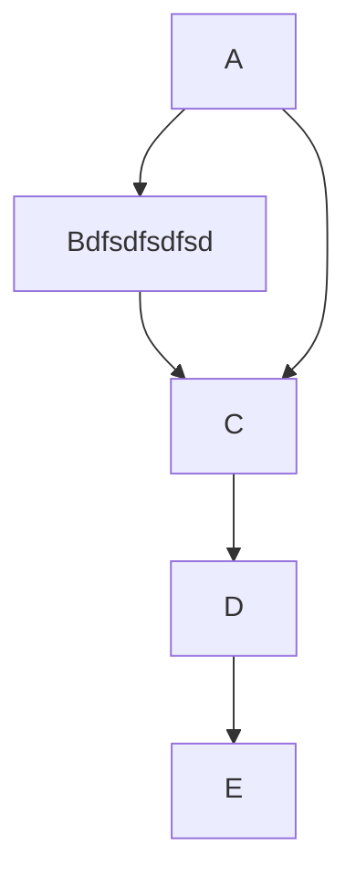

# Heading1
## Heading2
---
> quote

*italic*
**BOLD**
`monospace`
~~Strikethrough~~
H<sub>2</sub>O
dementia<sup>2</sup>
@github/support what abiiut
:smile:

- bullet 
* point
- [ ] #739

`#0969DA`

A [link](http://example.com).
Here is a simple footnote[^1] .
A footnote can also have multiple lines [^2] .  
You can also use words, to fit your writing style more closely[^note].

<!-- This content will not appear in the rendered Markdown -->
[MD Table Generator](https://www.tablesgenerator.com/markdown_tables)

| First Header  | Second Header | 
| ------------- | ------------- | 
| Content Cell  | Content Cell  | 
| Content Cell  | Content Cell  | 

<details><summary>CLICK ME</summary>
<p>

#### We can hide anything, even code!

```ruby
   puts "Hello World"
```

</p>
</details>

```
function test() {
  console.log("notice the blank line before this function?");
}
```

Here is a simple flow chart:



```diff
- text in red
+ text in green
! text in orange
# text in gray
@@ text in purple (and bold)@@
```

[^1]: My reference.
[^2]: Every new line should be prefixed with 2 spaces.  
  This allows you to have a footnote with multiple lines.
[^note]:
    Named footnotes will still render with numbers instead of the text but allow easier identification and linking.  
    This footnote also has been made with a different syntax using 4 spaces for new lines.